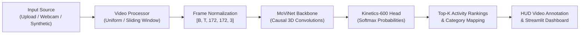

# 🏃 MoViNet Human Activity Recognition (HAR)

[](https://www.python.org/)
[](https://tensorflow.org)
[](https://streamlit.io)
[](https://opensource.org/licenses/MIT)
[](https://tfhub.dev/google/movinet/a0/base/kinetics-600/classification/3)

An end-to-end deep learning system for **Human Activity Recognition (HAR)** using Google Research's **MoViNet (Mobile Video Networks)** pre-trained on **Kinetics-600**.

Analyze video frames, detect temporal motion dynamics, and classify 600 predefined human activities (sports, gym workouts, dancing, musical instruments, daily chores, and locomotion) in real time.

---

## 🌟 Key Features

- **⚡ Google MoViNet Backbone:** State-of-the-art mobile video recognition using causal 3D convolutions with memory state.
- **🎯 600 Predefined Human Activities:** Out-of-the-box classification across Kinetics-600 categories.
- **🖥️ Futuristic Computer Vision HUD:** Overlays activity tags, confidence percentages, telemetry badges, and frame counters onto video clips.
- **🌐 Turn-key Streamlit Web App:** Polished UI with video upload, synthetic action generation, temporal analysis, and annotated MP4 export.
- **💻 Full Command-Line Interface (`cli_predict.py`):** Scriptable CLI for video files, webcam streams, and batch inference.
- **🧪 Built-in Synthetic Motion Generator:** Generate stickman motion clips (jumping jacks, squats, walking) to test out-of-the-box with zero downloads.
- **📈 Temporal Dynamics Timeline:** Sliding-window continuous action segmentation across multi-second videos.
- **🔄 Transfer Learning Pipeline (`src/train_transfer.py`):** Easily fine-tune MoViNet on your custom video datasets.
- **☁️ Streamlit Community Cloud Ready:** Includes `packages.txt` and `requirements.txt` for instant one-click cloud deployment.

---

## 🏗️ Architecture



---

## 📂 Repository Structure

```text
Human-Activity-Recognition-MoViNet/
│
├── .github/
│   └── workflows/
│       └── ci.yml               # Automated CI for linting and build validation
│
├── data/
│   └── kinetics_600_labels.txt  # Predefined 600 Kinetics action classes
│
├── sample_videos/               # Sample motion clips generated for testing
│
├── src/
│   ├── __init__.py
│   ├── config.py                # Hyperparameters, model handles, and categories
│   ├── model.py                 # MoViNetClassifier wrapper and inference engine
│   ├── video_processor.py       # Frame sampling, HUD annotation, and motion synthesis
│   ├── utils.py                 # Telemetry HUD drawing, plotting, and label utilities
│   └── train_transfer.py        # Complete custom dataset fine-tuning pipeline
│
├── app.py                       # Streamlit Web Application
├── cli_predict.py               # Command-Line Interface for video & webcam
├── requirements.txt             # Pinned Python package dependencies
├── packages.txt                 # Linux system packages for Streamlit Cloud
├── .gitignore                   # Git exclusion rules
├── LICENSE                      # MIT License
└── README.md                    # Project documentation
```

---

## ⚡ Quick Start

### 1. Clone Repository
```bash
git clone https://github.com/your-username/Human-Activity-Recognition-MoViNet.git
cd Human-Activity-Recognition-MoViNet
```

### 2. Set Up Virtual Environment
```bash
# Windows
python -m venv .venv
.venv\Scripts\activate

# Linux / macOS
python3 -m venv .venv
source .venv/bin/activate
```

### 3. Install Dependencies
```bash
pip install --upgrade pip
pip install -r requirements.txt
```

---

## 🖥️ Running the Streamlit Web Application

Launch the interactive dashboard locally:

```bash
streamlit run app.py
```

Open `http://localhost:8501` in your browser.

### Features in the Web App:
1. **Video File Upload:** Upload any `.mp4`, `.avi`, `.mov`, `.webm` file.
2. **Preloaded Test Samples:** Test preloaded jumping jacks, squats, and walking clips.
3. **Synthetic Generator:** Generate custom animated motion clips in seconds.
4. **Top-K Predictions:** High-resolution probability bar charts.
5. **HUD Annotation:** Render and download futuristic HUD video overlays.
6. **Temporal Action Dynamics:** Sliding-window line chart of activity changes over time.
7. **Kinetics-600 Activity Explorer:** Search all 600 predefined classes by category.

---

## 🚀 Deploying to Streamlit Community Cloud

This repository is pre-configured for one-click deployment on **Streamlit Community Cloud**:

1. **Push your code to GitHub:**
   ```bash
   git init
   git add .
   git commit -m "feat: Initial commit for MoViNet Human Activity Recognition"
   git branch -M main
   git remote add origin https://github.com/<your-github-username>/Human-Activity-Recognition-MoViNet.git
   git push -u origin main
   ```
2. Navigate to [share.streamlit.io](https://share.streamlit.io).
3. Connect your GitHub account and select your repository: `Human-Activity-Recognition-MoViNet`.
4. Set **Main file path** to `app.py`.
5. Click **Deploy!** Streamlit Cloud will automatically install dependencies from `requirements.txt` and `packages.txt`.

---

## 💻 Command-Line Interface (CLI)

You can run predictions directly from your terminal using `cli_predict.py`:

### Analyze a Video File:
```bash
python cli_predict.py --video path/to/video.mp4 --model movinet_a0_base --top_k 5
```

### Annotate Video and Export MP4 with HUD:
```bash
python cli_predict.py --video input.mp4 --output annotated_output.mp4 --frames 16
```

### Run on Synthetic Motion Action:
```bash
python cli_predict.py --synthetic jumping_jacks --top_k 5
```

### Live Webcam Stream:
```bash
python cli_predict.py --webcam 0 --model movinet_a0_base
```

---

## 🔄 Transfer Learning on Custom Datasets

Want to train MoViNet to classify your own custom activities (e.g. gym exercises, industrial safety compliance, physical therapy movements)?

### 1. Organize your Dataset
```text
my_dataset/
  ├── train/
  │     ├── bicep_curls/
  │     │     ├── clip_01.mp4
  │     │     └── clip_02.mp4
  │     └── lateral_raises/
  │           └── clip_01.mp4
  └── val/
        ├── bicep_curls/
        └── lateral_raises/
```

### 2. Execute Training
```bash
python src/train_transfer.py \
  --train_dir ./my_dataset/train \
  --val_dir ./my_dataset/val \
  --epochs 15 \
  --batch_size 4 \
  --lr 0.001 \
  --output_dir ./checkpoints
```

---

## 🔬 Model Variants

| Model Variant | Input Resolution | Frames / Clip | Parameters | Target Platform |
| :--- | :--- | :--- | :--- | :--- |
| **MoViNet-A0 (Base)** | 172 x 172 | 8 – 16 | 3.1M | Mobile / Low-power CPU |
| **MoViNet-A1 (Base)** | 172 x 172 | 8 – 16 | 4.8M | Real-time edge devices |
| **MoViNet-A2 (Base)** | 224 x 224 | 16 – 32 | 5.3M | Desktop / High-Accuracy GPU |

---

## 📚 References & Citation

- **MoViNet Paper:** Kondratyuk, D., et al. *"MoViNets: Mobile Video Networks for Efficient Video Recognition"*, CVPR 2021. [arXiv:2103.11511](https://arxiv.org/abs/2103.11511).
- **Kinetics-600 Dataset:** Carreira, J., et al. *"A Short Note on the Kinetics-600 Human Action Dataset"*, arXiv:1808.01340.
- **TensorFlow Models Garden:** [official/projects/movinet](https://github.com/tensorflow/models/tree/master/official/projects/movinet).

---

## 📄 License

This project is licensed under the [MIT License](LICENSE).
